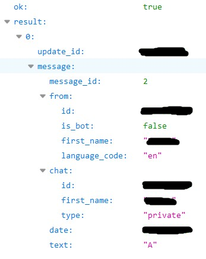

# telegram-bot-api-php
Telegram bot api using PHP

### Before start using:
* Create personal bot using BotFather: [core.telegram.org/bots](https://core.telegram.org/bots#3-how-do-i-create-a-bot)
* Save bot authentication token.
* Open link on browser https://api.telegram.org/bot<your_authentication_token>/getUpdates .
* Message your bot using Telegram, to begin messaging press/write `/start`
* Refresh opened link to get json data. 

* Save your Telegram id if you planning to message yourself using bot. You can find your id in from.id and chat.id .
* Set up webhook: `https://api.telegram.org/bot<your_authentication_token>/setwebhook?url=<url_to_bot.php_file>`
* Set up MySQL database and change credentials in database.php file, if you planning to save user id and their selected language.
  
#### Useful information

To add custom commands to bot window, chat with BotFather and send him `/setcommands` and then write `command - command_name`
`%0A - new line in text` 
`strpos - find the position of the first occurrence of a substring in a string.` 
`strcmp - string comparison, if returns 0 two strings are equal.` 
 
More information about Telegram bot api:
(https://core.telegram.org/bots/api#making-requests)
 
### MySQL database structure: 
`CREATE TABLE 'Users' (
  'userid' int(11) NOT NULL,
  'name' varchar(60) COLLATE utf8_general_ci NOT NULL,
  'language' int(11) NOT NULL DEFAULT 0
) ENGINE=InnoDB DEFAULT CHARSET=utf8 COLLATE=utf8_general_ci;`
